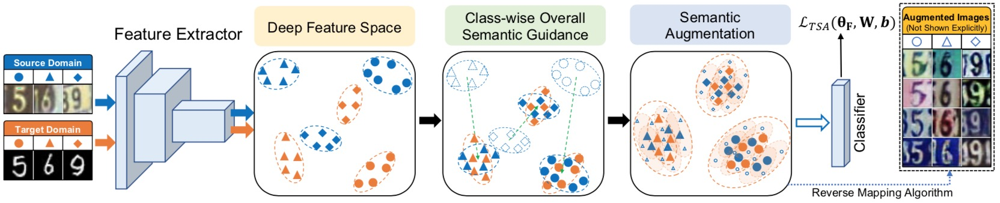

# Transferable Semantic Augmentation for Domain Adaptation

Code release for "Transferable Semantic Augmentation for Domain Adaptation" (CVPR 2021)

## Paper

<div align=center></div>

[Transferable Semantic Augmentation for Domain Adaptation](https://arxiv.org/abs/2103.12562) 
(CVPR 2021)

We propose a Transferable Semantic Augmentation (TSA) approach to enhance the classifier adaptation ability through implicitly generating source features towards target semantics.

## Prerequisites
The code is implemented with **CUDA 10.0.130**, **Python 3.7** and **Pytorch 1.7.0**.

To install the required python packages, run

```pip install -r requirements.txt```

## Datasets

### Office-31
Office-31 dataset can be found [here](https://people.eecs.berkeley.edu/~jhoffman/domainadapt/).

### Office-Home
Office-Home dataset can be found [here](http://hemanthdv.org/OfficeHome-Dataset/).

### VisDA 2017

VisDA 2017 dataset can be found [here](https://github.com/VisionLearningGroup/taskcv-2017-public).

## Running the code

Office-31
```
python3 train_TSA.py --gpu_id 4 --arch resnet50 --seed 1 --dset office --output_dir log/office31 --s_dset_path data/list/office/webcam_31.txt --t_dset_path data/list/office/amazon_31.txt --epochs 40 --iters-per-epoch 500 --lambda0 0.25 --MI 0.1

```

Office-Home
```
python3 train_TSA.py --gpu_id 4 --arch resnet50 --seed 0 --dset office-home --output_dir log/office-home --s_dset_path data/list/home/Art_65.txt --t_dset_path data/list/home/Product_65.txt --epochs 40 --iters-per-epoch 500 --lambda0 0.25 --MI 0.1
```

VisDA 2017
```
python3 train_TSA.py --gpu_id 4 --arch resnet101 --seed 2 --dset visda --output_dir log/visda --s_dset_path data/list/visda2017/synthetic_12.txt --t_dset_path data/list/visda2017/real_12.txt --epochs 30 --iters-per-epoch 1000 --lambda0 0.25 --MI 0.1
```

## Citation
If you find this code useful for your research, please cite our [paper](https://arxiv.org/abs/2103.12562):
```
@inproceedings{Li2021TSA,
    title = {Transferable Semantic Augmentation for Domain Adaptation},
    author = {Li, Shuang and Xie, Mixue and Gong, Kaixiong and Liu, Chi Harold and Wang, Yulin and Li, Wei},
    booktitle = {2021 {IEEE/CVF} Conference on Computer Vision and Pattern Recognition, {CVPR} 2021, Seattle, WA, USA, June 19-25, 2021},   
    year = {2021}
}
```

## Acknowledgements
Some codes are adapted from [ISDA](https://github.com/blackfeather-wang/ISDA-for-Deep-Networks) and 
[Transfer-Learning-Library](https://github.com/thuml/Transfer-Learning-Library). We thank them for their excellent projects.

## Contact
If you have any problem about our code, feel free to contact
- shuangli@bit.edu.cn
- michellexie102@gmail.com
- kxgong@bit.edu.cn

or describe your problem in Issues.
